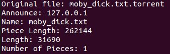

# BitTorrent Client in C
Team Dubstep Ducks

Project 1 for the Software Systems class

## Quickstart
For setup and usage instructions see our [README](./README.md)

## Abstract
The team attempted to create a peer to peer file transfer system modelled on the BitTorrent protocol. Peer to peer file transfer systems have several advantages over traditional server to client transfers. They are very resilient to node outages, as each client is capable of transferring the whole file if needed. They are faster, because the amount of data each client has to transfer is much less than the overall size of the file, so the transfer rate is mostly limited by the download capacity of the client. However, to enable this peer to peer behaviour, the clients must share a set of metadata in common, which contains information such as the size of the file and how to obtain the IP addresses of other peers. This information is stored within a torrent file, containing relevant file information, hashes of file pieces to ensure data is delivered correctly, and the IP of a tracker server.

The purpose of the tracker server is to accept torrent client communications and relay the IP addresses of connected clients. This is done so that each torrent client may know the addresses of its peers.

The torrent client itself is responsible for the partitioning and transfer of the desired file between itself and the other clients. Depending on the number of available clients, each client may only be responsible for transferring a segment of the file.

## Background
Our project resides in well-explored territory. There are quite a few torrent clients under development, and ours does nothing new compared to those. However, the inner mechanisms for these systems are not publicised as they are proprietary. Only the messaging protocols are publicly known. Thus, knowing the format in which messages should be sent, the team wanted to explore how these messages are handled by the program. 

## Implementation
We chose to implement two major facets of a peer to peer system: a centralized tracker server, and a client that would be run on many machines. The central server's purpose is to keep track of active clients, relay this list to the clients, and serve the torrent metadata file to the clients. The client's responsibility is to talk to other clients, manage file requests that it sends to other clients, and listen for file requests to send the correct file pieces.

### Tracker Server
The tracker server listens on a single port for incoming connections from clients. Upon receiving a client, it adds the client's IP address to the list of active clients if not already present. This whole process is a blocking operation, which means that any incoming connections will be ignored while the operation is happening. This was a design choice made to simplify the codebase and ease debugging. The tradeoff in serial operations versus multithreading was deemed acceptable as the operation was fairly quick, and connections were infrequent. Both implementations were created to test the validity of this decision, and confirmed that it was ok (see [this version of the tracker](https://github.com/Daniel6/SoftSysDubstepDucks/blob/0260d2760e1e45d7fd8c5add2216bc9ab78462fc/examples/tracker/tracker2.c) for a multithreaded tracker server implementation). 

The data structure backing the list of clients is a singly linked list. This was chosen over an array or buffer as the array implementation had complications with memory and the buffer was inefficient for adding and removing elements. The linked list adds clients in O(1) time complexity and removes them in O(n). The array and buffer implementations were of the same average complexity, but required occasional resizing and shifting operations, which increased their runtime.

### Torrent File Creation

We created torrent files following the BitTorrentSpecification, storing information in a bencoded format.  Meta information about the file is stored in the bencoded format after parsing and partitioning the original file, and output to a file with a .torrent extension.  File information is obtained by parsing the original file by bytes and hashing each file piece, then storing information in memory before exporting everything in the bencoded format.

### Torrent File Parsing

Our torrent file parsing utilizes a library created by Mike Frysinger and edited by Adam Aviv, and extracts the bencoded information from a torrent file.  The extracted information is then used to populate a struct, which can then be used by other programs to easily access torrent file information.

## Results
Ultimately we were unable to complete the project as originally envisioned. However, we did complete many of the subcomponents that we would integrate to complete the final product. The list of working components includes the tracker server, client handshake routine, and torrent file generating process.

### Tracker Server
The tracker server was improved in the final iteration to no longer accept duplicate entries to the list of connected clients. Some further backend optimizations were made to simplify the decision tree and codebase. The tracker client was integrated with the torrent client such that initializing the torrent automatically registered the client with the tracker and retrieved the list of connected clients.

*Torrent client connecting to tracker server on local machine.*

*Client A connects to the tracker server and sees only 1 client, himself.*

*Client B connects to the tracker server and sees 2 clients, himself and Client A.*

*The tracker server sees Client A connect and then Client B.*

### Learning Objectives
This project was intended to be a learning exercise for the team to familiarize with the C language and get hands on experience. We accomplished the learning goals which we established at the creation of the project, those being to:

* learn about networking in C and how messages are handled on a low level
* learn about multiprocessing in C and managing shared resources
* learn how to write clean and readable C code
* practice making intelligent design choices

So while the project was not as functional as we had hoped, it still proved to be a valuable learning experience and was successful in allowin the team to gain in depth experience in their fields of interest.
