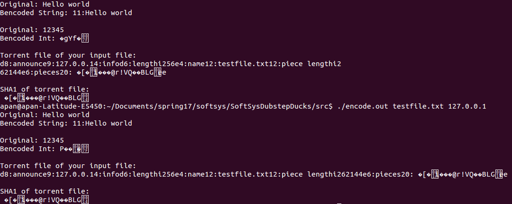

# BitTorrent Client in C
Team Dubstep Ducks

Project 1 for the Software Systems class

## Quickstart
For setup and usage instructions see our [README](./README.md)

## Abstract
The team attempted to create a peer to peer file transfer system modelled on the BitTorrent protocol. Peer to peer file transfer systems have several advantages over traditional server to client transfers. They are very resilient to node outages, as each client is capable of transferring the whole file if needed. They are faster, because the amount of data each client has to transfer is much less than the overall size of the file, so the transfer rate is mostly limited by the download capacity of the client. However, to enable this peer to peer behaviour, the clients must share a set of metadata in common, which contains information such as the size of the file and how to obtain the IP addresses of other peers. This information is stored within a torrent file, containing relevant file information, hashes of file pieces to ensure data is delivered correctly, and the IP of a tracker server.

The purpose of the tracker server is to accept torrent client communications and relay the IP addresses of connected clients. This is done so that each torrent client may know the addresses of its peers.

The torrent client itself is responsible for the partitioning and transfer of the desired file between itself and the other clients. Depending on the number of available clients, each client may only be responsible for transferring a segment of the file.

## Background
We modelled our project on the BitTorrent system, which is one of the most widely used torrenting implementations today. BitTorrent uses a tracker server to coordinate clients and distribute a metadata file communicating important torrent metadata. The tracker server relays the ip's and ports of clients so that the clients may talk to each other. Clients are also able to accept new clients on peer to peer connections. Among clients, BitTorrent has 3 classifications based on the network traffic of the client. A seeder is a client that is only uploading data to other clients, a leecher is a client that is only downloading, and a peer is a client which both uploads and downloads data.

BitTorrent protocol specifies many different messages for clients to use when communicating with eachother. A seeding client broadcasts a bitfield message to other clients, containing information about what pieces of data the seeder has available to upload. Leeching clients then consult this message, and send a request for data to the seeder, attempting to open a connection.

By default, when a peer to peer connection opens, both ends are flagged as choked and uninterested. The choked status represents the capacity of either client to send/receive data. The interested status represents whether the data is still being requested (since multiple connections can be opened for the same data, the remaining connections must be closed when the data is received). In order to transfer data on the connection, both sides must be unchoked, and the receiver must be interested.

Once the connection is unchoked and the leecher is interested, the seeder sends piece messages containing data that the leecher requested. If the leecher requested a large chunk of data, multiple piece messages might be sent to complete the data transfer. At any point in time, the leecher can send a cancel message to the seeder to cancel the transfer. This is mainly used if the leecher is shutting down, or has already received the data from another seeder.

In addition to these messaged, the clients send ping messages to each other to check their statuses. If a client is unresponsive, then it gets dropped by the other client.

Our implementation of a peer to peer file transfer system follows this architecture very closely, down to the formatting of the messages.

## Implementation
We chose to implement two major facets of a peer to peer system: a centralized tracker server, and a client that would be run on many machines. The central server's purpose is to keep track of active clients, relay this list to the clients, and serve the torrent metadata file to the clients. The client's responsibility is to talk to other clients, manage file requests that it sends to other clients, and listen for file requests to send the correct file pieces.

### Tracker Server
The tracker server listens on a single port for incoming connections from clients. Upon receiving a client, it adds the client's IP address to the list of active clients if not already present. This whole process is a blocking operation, which means that any incoming connections will be ignored while the operation is happening. This was a design choice made to simplify the codebase and ease debugging. The tradeoff in serial operations versus multithreading was deemed acceptable as the operation was fairly quick, and connections were infrequent. Both implementations were created to test the validity of this decision, and confirmed that it was ok (see [this version of the tracker](https://github.com/Daniel6/SoftSysDubstepDucks/blob/0260d2760e1e45d7fd8c5add2216bc9ab78462fc/examples/tracker/tracker2.c) for a multithreaded tracker server implementation). 

The data structure backing the list of clients is a singly linked list. This was chosen over an array or buffer as the array implementation had complications with memory and the buffer was inefficient for adding and removing elements. The linked list adds clients in O(1) time complexity and removes them in O(n). The array and buffer implementations were of the same average complexity, but required occasional resizing and shifting operations, which increased their runtime.

### Torrent File Creation

We created torrent files following the BitTorrentSpecification, storing information in a bencoded format.  Given a file of an arbitrary format, meta information about the file is stored in the bencoded format after parsing and partitioning the original file, and output to a file with a .torrent extension.  File information is obtained by parsing the original file by bytes and hashing each file piece, then storing information in memory before exporting everything in the bencoded format.  All information is properly mapped to using standard bencoded dictionary keys, so clients can extract the address of the tracker server for the file, file name, file length, piece length, number of pieces, and SHA1 hashes of each piece.

### Torrent File Parsing

Our torrent file parsing utilizes a library created by Mike Frysinger and edited by Adam Aviv, and extracts the bencoded information from a torrent file.  The extracted information is then used to populate a struct, which can then be used by other programs to easily access torrent file information.  The struct contains all of the information from the torrent including file name, size, and tracker server address, in addition to a list of all file piece hashes.

### Peer to Peer Communication

Following the BTP/1.0 protocol standards as explained in [this document](http://jonas.nitro.dk/bittorrent/bittorrent-rfc.html), we laid out what protocols we would be following before attemping to implement any network communications.

Communication between any two peers is done over sockets. Following client-server standards for socket communication, we were able to send information as strings over a socket from a server to a client. However, in BitTorrent, each peer acts as both a client and a server. Thus, each peer has a listener socket over which it listens for new incoming clients. When this peer wants to join the network, it connects to the tracker server and reports its IP so other peers can connect to its listener socket, and in return it receives all other peers' IPs. The peer connects to all of these remote peers over their own sockets.

As our protocol dictates, the first thing a peer does when connecting to a remote peer as a client is to send a handshake message, alerting the remote peer that this client is interested in opening a connection. The remote peer responds with its own handshake and information about what parts of the file of interest it has. After learning what pieces all of the remote peers have, the client begins sending intersted messages in hopes of ultimately being able to download pieces of the file from the peers. After communications have begun, this local peer also can act as a server to remote clients.

In order to track all of these remote connections, we created a struct to store information about every peer. This information includes a number of flags pertaining to what the local peer's statuses and the remote peer's statuses are in regards to this communication: the file descriptor of the socket, choked and interested statuses, the remote peer's bitfield, if the local peer has requested a file piece, what piece it has requested, and what piece it should send to the remote peer. 

In order to handle all of these open sockets, we used `poll()`. Polling provides us with I/O multiplexing; instead of infintely iterating through every single connection to check if the local peer was sent a message from the corresponding remote peer, poll alerts the local peer when there is a socket that is ready to have information be sent or received. Polling also allows the local peer to check which of the specific sockets are ready for activities.

## Results
Ultimately we were unable to complete the project as originally envisioned. However, we did complete many of the subcomponents that we would integrate to complete the final product. The list of working components includes the tracker server, client handshake routine, and torrent file generating process.

### Tracker Server
The tracker server was improved in the final iteration to no longer accept duplicate entries to the list of connected clients. Some further backend optimizations were made to simplify the decision tree and codebase. The tracker client was integrated with the torrent client such that initializing the torrent automatically registered the client with the tracker and retrieved the list of connected clients.

  
*Torrent client connecting to tracker server on local machine.*

  
*Client A connects to the tracker server and sees only 1 client, himself.*

  
*Client B connects to the tracker server and sees 2 clients, himself and Client A.*

  
*The tracker server sees Client A connect and then Client B.*

### Torrent File Creation

*Tests for bencoding strings and integers perform as per standard.  After inputting the name of a text file and an address for a tracker server, a torrent file is created*

### Torrent File Parsing

*Given a torrent file, all relevant meta file information is extracted*

### Torrent Client Handshake Protocol

Upon receiving a list of peers to talk to, the torrent client is able to verify that the peers are running the same torrent client by performing a software handshake with them.

  
*Client B connects to the tracker server and sees one other client, Client A. Client B then successfully handshakes with Client A.*

  
*Client A connects to the tracker server, and then receives a handshake from Client B.*

Ideally the next step in this process would be to begin the file transfer process between clients, however due to time constraints we are unable to produce a working example for this behavior.

## Learning Objectives
This project was intended to be a learning exercise for the team to familiarize with the C language and get hands on experience. We accomplished the learning goals which we established at the creation of the project, those being to:

* Learn about networking in C and how messages are handled on a low level
* Learn about multiprocessing in C and managing shared resources
* Learn how to write clean and readable C code
* Understand how to work with file structures in C
* Practice making intelligent design choices

So while the project was not as functional as we had hoped, it still proved to be a valuable learning experience and was successful in allowing the team to gain in-depth experience in their fields of interest.
