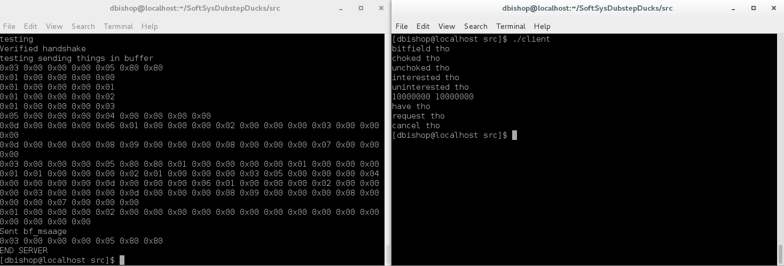
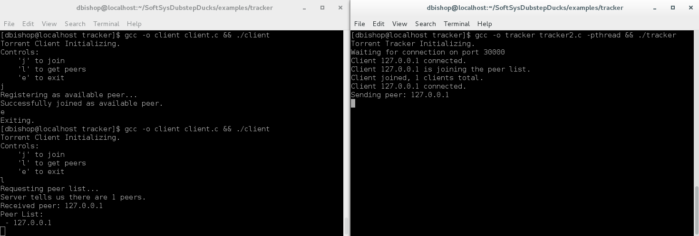
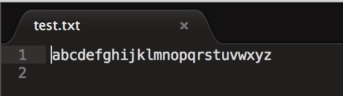
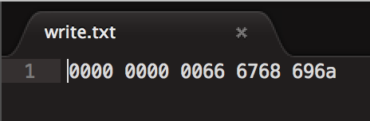
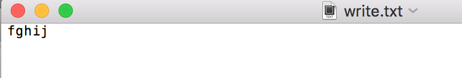

## Preliminary Report
##### 2/13/2017
Daniel Bishop, Andrew Pan, Thuc Tran, Jordan Van Duyne

### Project Goal
The goal of this project is to create a peer to peer file transfer network. Basic features of this network would be the ability to add and drop clients at will, and transfer files from multiple peers to a single peer faster than a traditional FTP request. Additional features of this project may include enhanced error detection or redundant file transfers to accommodate peers unexpectedly going offline. These features would bring us closer to the functionality of the BitTorrent system.

### Trello Cards
#### Sprint 1
Readings completed individually:
* HFC 1
* HFC 2
* HFC 3
* HFC 11  

Project related work:
* Define network protocols
  * [protocol](https://github.com/Daniel6/SoftSysDubstepDucks/blob/master/protocol.md)
* Implement file transfer
* Establish client-server connection between two computers
* Develop handshake and verification  

#### Sprint 2
Readings completed individually:
* TOS 1
* TOS 2
* TOS 3
* TOS 4  

Project related work:
* Set up torrent file parsing for the partition of files
* Deconstruction and reconstruction of files
  * [file constructor/deconstructor](https://github.com/Daniel6/SoftSysDubstepDucks/blob/file-construction/examples/file-construction/file_constructor.c)
* Piece-peer request assigner
  * [piece assigner code](https://github.com/Daniel6/SoftSysDubstepDucks/blob/piece-selection/piece_selection/piece_selector.c)
* Set up tracker server and client

### Preliminary Results  
#### Segmented File Transfer
We were able to demonstrate the interpretation and construction of protocol compliant messages excluding the PIECE message in the following image. The left side represents the server, and each line of the output corresponds to the hex representation of the messages that we want to send, with the larger block of hex at the end representing the concatenated buffer we wish to send. The right side represents the interpretation of the messages after the messages were sent. 

#### Tracker Server and Client
The tracker server and client have established basic communications. The client is able to register itself on the tracker, and also receive a list of all other registered peers. This is enough to move forwards with although it could benefit from more robustness. Here we see an example of a client connecting and registering with the tracker, and then a new client retrieving the first client's IP from the tracker.

#### File Deconstruction and Reconstruction  
We can extract a given “piece” (section) of a file and save it to a buffer. We can also take what is in a buffer and write it to a given file.
In this example, we read the 1st piece (0-indexing), where pieces are 5 characters long, from text.txt and saved it to a buffer. This was the string “fghij”. We then wrote this string to the previously non-existent file write.txt. By specifying that we were writing the 1st piece where pieces are of length 5, we were able to write to the correct offset position in write.txt (the data that should be where the 0th piece is consists of 0s). As expected of most torrented files, the write.txt file should be able to work file in a typical program that reads such a file, even if some of the pieces are missing. Thus, if we open write.txt in a normal text editor (such as Mac’s TextEdit), we see that we have indeed written “fghij”.

### Updated Project Backlog
See our [trello](https://trello.com/b/vVNhx3WF/softsysdubstepducks)

### Progress Blockers
We may face problems with integrating the different functions we wrote separately and with debugging our programs as they become larger and larger. We don’t foresee requiring instructor assistance as these problems will be addressed by us in due time, and will not require any materials.

### Annotated Bibliography
[https://github.com/bschmaltz/c-p2p-chat](https://github.com/bschmaltz/c-p2p-chat)

- Peer-to-peer chat client written in C. Allows for grouping of clients. Uses tracker-clients framework that we can repurpose to set up file distribution. Easy to read.

[http://beej.us/guide/bgnet/output/html/multipage/index.html](http://beej.us/guide/bgnet/output/html/multipage/index.html)

- Widely regarded text for socket and networking programming. Provides explanation on the basics of working with sockets and networking, then details the protocols of IPv6.

[http://www.kristenwidman.com/blog/33/how-to-write-a-bittorrent-client-part-1/](http://www.kristenwidman.com/blog/33/how-to-write-a-bittorrent-client-part-1/)

- This source lists the basic steps that are involved in writing a BitTorrent client.  It discusses from a high-level how various aspects of the client should be implemented and how peers can communicate.

[http://jonas.nitro.dk/bittorrent/bittorrent-rfc.html](http://jonas.nitro.dk/bittorrent/bittorrent-rfc.html)

- This document provides a detailed description of the BitTorrent Protocol version 1.0 referred to as "BTP/1.0". We modeled our own protocol after the standard specifications detailed here.

[https://www.cs.swarthmore.edu/~aviv/classes/f12/cs43/labs/lab5/lab5.pdf](https://www.cs.swarthmore.edu/~aviv/classes/f12/cs43/labs/lab5/lab5.pdf)

- This PDF is a description of an assignment at Swarthmore to write a BitTorrent client. This document provides some details about how the BitTorrent Protocol is specified and provides information about which aspects of BitTorrent are extraneous and can be a stretch goal for our project.

[http://stackoverflow.com/questions/11952898/c-send-and-receive-file](http://stackoverflow.com/questions/11952898/c-send-and-receive-file)

- Community example of using C system library to send and receive files. Basic buffering for transfer, worth looking into for example on how to do file transfers over network.

[http://www.bittorrent.org/beps/bep_0000.html](http://www.bittorrent.org/beps/bep_0000.html)

- List of documents about BitTorrent Protocol. These documents will be helpful for understanding the constraints that are required for BTP, and the intention and ideas behind the project.  

[https://allenkim67.github.io/bittorrent/2016/05/04/how-to-make-your-own-bittorrent-client.html](https://allenkim67.github.io/bittorrent/2016/05/04/how-to-make-your-own-bittorrent-client.html)

- This document is a description of how to write a torrent client in node.js. It can serve as a guide for determining the kind of mentality and process needed for p2p file transfer. In particular, we will be focusing on using this to better understand the protocol’s process and the mechanics that underlie how to properly send and receive files.
